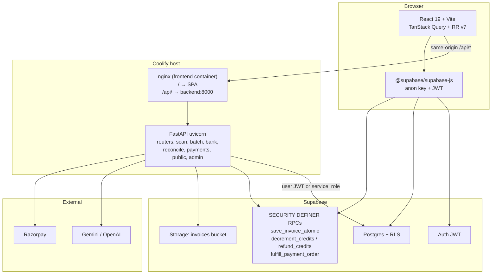
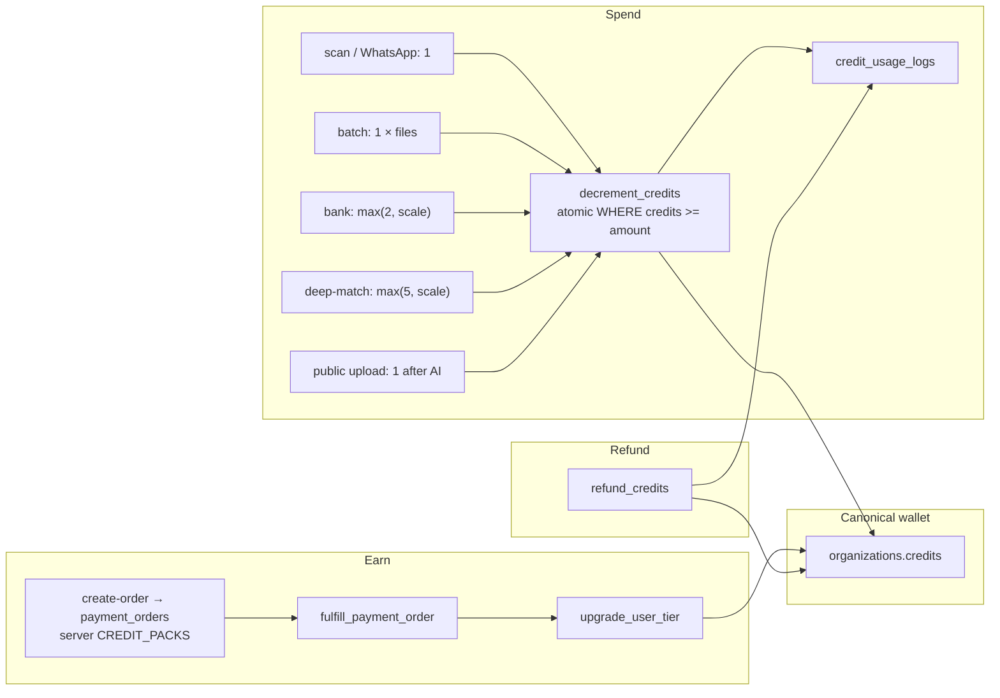

# Architecture & Optimization Audit — KhataLens (GST SAAS)

**Date:** 2026-07-21  
**Scope:** Architecture, credit/wallet integrity, core feature correctness, code quality, performance, security  
**Stack:** React 19 + Vite + Tailwind v4 · FastAPI · Supabase Postgres/Auth · Coolify (docker-compose + nginx same-origin `/api`)  
**Related:** `docs/incident_scan_save_client_switch_2026-07-21.md`, phases 57–59 (shipped), ProGate removal (`da96538`)

---

## 1. Executive summary

KhataLens is a coherent multi-tenant CA platform: org-scoped wallets, JWT-backed FastAPI routes proxied same-origin, and solid atomic deduct RPCs for the happy path. Recent incident work (scan auto-save closure, RLS/RPC casts, credits-only gating) improved core reliability.

The highest remaining risks are **wallet integrity and monetization trust boundaries**:

1. Credit RPCs historically trusted caller-supplied `user_id` without `auth.uid()` binding (cross-tenant mint/drain via PostgREST).
2. `create-order` trusted client `amount`/`credits` (pack inflation).
3. Bank failure refund used `decrement_credits(amount=-N)`, which is **log-only** — credits were never restored.
4. Batch ZIP charged **before** zip-bomb validation.
5. Signup trigger still inserted dropped `profiles.credits` (phase 54).

**This audit sprint implemented fixes for those P0/P1 items** (see §8). Remaining work is RBAC product decisions, public-upload hardening, page modularization, and recon grid virtualization.

Knowledge graph was empty at audit start (`build_or_update_graph` hit a DB lock); findings are evidence-based from migrations + source via parallel domain audits.

---

## 2. Architecture diagram

**Deploy note:** Empty `VITE_API_URL` is intentional. `getApiUrl()` falls back to `window.location.origin` so `/api` hits nginx → backend. Do not invent `api.*` DNS unless `VITE_API_URL` points there.

---

## 3. Credit system map

| Task | Backend cost | Notes |
|------|--------------|-------|
| Invoice scan | 1 | Pre-deduct; refund on AI fail |
| WhatsApp scan | 1 | Same |
| Batch ZIP | 1 × valid files | Validate then deduct (fixed this sprint) |
| Bank statement | `max(2, ceil(pages/5)×2)` or row scale | Upfront; refund via `refund_credits` on fail (fixed) |
| Deep match | `max(5, ceil(items/20)×5)` | Gemini key check before deduct (fixed) |
| Public upload | 1 | Still post-AI — residual P1 |
| Packs | starter 1000@₹2499 · pro 5000@₹7999 | Server catalog (fixed) |

**Org vs profile:** Wallet is **org-level**. `profiles.credits` was dropped in phase 54; leftovers (admin quota, docs, signup trigger) were debt — partially fixed this sprint.

---

## 4. Per-area findings

Severity: **P0** ship-blocker / money-security · **P1** high · **P2** hygiene.

### 4.1 Architecture & deploy

| ID | Sev | Finding | Evidence | Recommendation |
|----|-----|---------|----------|----------------|
| A1 | — | Same-origin `/api` via nginx is correct | `frontend/nginx.conf`, `docker-compose.yml`, `lib/api.ts` | Keep; document in onboarding |
| A2 | P2 | CORS allowlist hard-coded; Coolify host may differ | `backend/main.py` | **Done:** `CORS_ORIGINS` env (comma-separated); defaults preserved; rejects `*` |
| A3 | P2 | Auth duplicated per route; `utils.get_current_user` underused | routers vs `utils.py` | **Progress:** Depends on scan/payment/public + batch/bank/reconcile/sales/usage/bank_reconcile |
| A4 | P2 | Scan still in `main.py` (~600 lines) | `main.py` | **Done:** extracted `scan_routes.py` |
| A5 | P2 | Nested `/` public + protected routes | `App.tsx` | Prefer `/app/*` shell (deferred) |

### 4.2 Credit / wallet

| ID | Sev | Finding | Evidence | Recommendation / status |
|----|-----|---------|----------|-------------------------|
| C1 | P0 | `decrement_credits` / `refund_credits` lacked `auth.uid()` binding | phase41, phase54 | **Fixed** phase60 |
| C2 | P0 | `create-order` trusted client credits/amount | `payment_routes.py` | **Fixed** `CREDIT_PACKS` |
| C3 | P0 | Bank refund used negative `decrement_credits` (no-op) | `bank_service.py` | **Fixed** → `refund_credits` |
| C4 | P0 | Batch deducted before zip-bomb check | `batch_routes.py` | **Fixed** validate→deduct; refund on insert fail |
| C5 | P0 | `handle_new_user` inserts `profiles.credits` | phase44 vs phase54 | **Fixed** phase60 |
| C6 | P1 | Deep match deducted before Gemini key check | `reconcile_routes.py` | **Fixed** |
| C7 | P1 | Admin quota wrote dead `profiles.credits` | `admin_routes.py` | **Fixed** → `organizations.credits` |
| C8 | P1 | Public upload: AI before deduct | `public_routes.py` | Deduct/reserve before AI |
| C9 | P1 | Batch/deep-match worker failures often no partial refund | workers | Policy + refund helpers |
| C10 | P2 | `upgrade_user_tier` may credit multiple orgs; weak ledger | phase54 | Single-org target + `transactions` insert |
| C11 | P2 | UI said Deep Match “1 Credit” | `ReconciliationPage.tsx` | **Fixed** copy |

### 4.3 Core features

| Area | Health | Notes |
|------|--------|-------|
| Scan / save | Good post-incident | Do not regress clientId binding / `save_invoice_atomic` |
| Clients | Good | Phase 58 `create_client_secure`; multi-org `LIMIT 1` still P2 |
| GSTR-2B recon | Good | Strong memoization; large grids need virtualization |
| Bank | Good | Ownership aligned with `has_client_access` (firm-wide) |
| Tax liability | OK | Uses ErrorState |
| Virtual CFO | Improved | ErrorState added; routes ungated post-ProGate |
| Audit logs | OK | Phase 59 triggers; UI mapping fixed recently |
| Collaboration / Snap | Risk | Public `client_id` UUID upload — service role path |
| WhatsApp | OK pattern | Deduct + refund; service role worker |

### 4.4 Code quality & frontend

| ID | Sev | Finding | Evidence | Recommendation / status |
|----|-----|---------|----------|-------------------------|
| F1 | P1 | Scattered API URL resolution | 7 pages vs `getApiUrl` | **Fixed** unify on `getApiUrl()` |
| F2 | P1 | Wallet / CFO missing ErrorState | pages | **Fixed** |
| F3 | P1 | Unbounded wallet transactions select | WalletPage | **Fixed** `.limit(50)` |
| F4 | P1 | Unbounded clients invoice id fetch | `ClientsPage.tsx` | Aggregate RPC / count |
| F5 | P1 | Recon period `select('*')` + dual map, no virtualization | `ReconciliationPage.tsx` | Column project + virtualize |
| F6 | P1 | `/admin` UI has no client role gate | `App.tsx` | Soft gate + API enforce |
| F7 | P2 | Mega-pages Scan (~1055), Settings (~858) | pages | Split modules |
| F8 | P2 | Docs still describe ProGate | monetization docs | Update docs |

### 4.5 Security & RLS

| ID | Sev | Finding | Evidence | Recommendation |
|----|-----|---------|----------|----------------|
| S1 | P1 | Phase 57 `has_client_access` = any org member | phase57 | **Decided:** firm-wide org membership is the product default. `client_assignments` remains for optional cross-org assignees only — do not restore assignment-required RLS. |
| S2 | P1 | Public upload by UUID | `public_routes.py` | Signed tokens + budgets |
| S3 | P1 | Batch/bank/GSTR ownership = `clients.user_id` only | batch/bank/reconcile/sales | **Done:** all use `utils.verify_client_access` → `has_client_access` |
| S4 | P2 | Phase 58 `set_default_org_id` allows client-supplied org | phase58 | Prefer force `active_org_id` |
| S5 | — | CORS not `*`; security headers present | `main.py` | Keep |

### 4.6 Performance

| ID | Sev | Finding | Recommendation |
|----|-----|---------|----------------|
| P1 | P1 | Recon 1k+ rows: no virtualization | `@tanstack/react-virtual` or windowing |
| P2 | P2 | Admin tenants full-table profiles | Paginate |
| P3 | — | Batch semaphore(5), scan chunk 5, bank chunks | Keep |
| P4 | P2 | N+1 risk in admin / heavy gathers | Bound parallelism |

---

## 5. Prioritized backlog

### P0 (done this sprint or apply migration ASAP)

1. Apply `supabase/migrations/migration_phase60_credit_rpc_hardening.sql` on prod/staging.
2. Deploy backend: bank refund, batch order, payment catalog, admin quota, deep-match key order.
3. Deploy frontend: `getApiUrl`, Wallet/CFO ErrorState, Deep Match copy.

### P1 (next 1–2 weeks)

1. Public upload: deduct/reserve before AI; signed upload tokens; tighter rate limits.
2. ~~Align bank/batch ownership with `has_client_access`.~~ **Done** (`5f7c6a8`); GSTR reconcile + sales aligned to same helper.
3. ~~Decide RBAC: restore `client_assignments` vs firm-wide access; document.~~ **Decided: firm-wide** (S1). Assignments table kept for cross-org edge cases only.
4. Clients page aggregate counts; recon column projection + virtualization.
5. Soft-gate `/admin` + `/cfo` if monetization requires it (API still authoritative). ~~Done soft-gate~~ (`e91a525`).
6. Restore `transactions` ledger writes in `upgrade_user_tier`. ~~Done~~ (`ae53718`).
7. Refund policy for failed batch workers / deep-match AI exceptions. ~~Done~~ (`f0e06cf`).

### P2 (later)

1. ~~Extract scan routes; env CORS.~~ **Partial** (`scan_routes.py`, `CORS_ORIGINS`, `credits.INVOICE_SCAN`) — ScanPage/Settings split still open.
2. Split ScanPage / SettingsPage.
3. ~~Centralize remaining costs in `backend/credits.py`.~~ **Done** this pass — bank/deep-match/batch helpers + `Depends(get_current_user)` on batch/bank/reconcile/sales/usage-logs/bank_reconcile.
4. Update stale monetization / ProGate docs (partial: CREDITS_DOCUMENTATION points at `credits.py`).
5. Rebuild code-review-graph DB (was locked/empty during audit) — deferred.
6. Prefer `/app/*` shell for nested public/protected routes — deferred.

---

## 6. Do not regress

1. **Scan auto-save:** pass explicit `clientId` / file snapshot into save; never close over stale `fileStates` alone (`0124b62`).
2. **`save_invoice_atomic`:** keep `auth.uid()` check, `has_client_access`, safe JSON casts (phase 58).
3. **Credits-only gating:** do not reintroduce hard ProGate feature locks without product sign-off (`da96538`).
4. **Same-origin API:** empty `VITE_API_URL` + nginx `/api` is correct for Coolify.
5. **Atomic deduct:** always `UPDATE … WHERE credits >= amount`; never SELECT-then-UPDATE for spend.
6. **Refunds:** use `refund_credits`, never negative `decrement_credits`.
7. **WalletPage `usageLogs`:** always treat as array before `.reduce` / `.map`.
8. **Payment fulfill:** trust `payment_orders.expected_*` + `fulfill_payment_order` idempotency, not client body.

---

## 7. Suggested next implementation sprint (1–2 weeks)

| Day | Focus | Outcome |
|-----|-------|---------|
| 1 | Apply phase60 + verify signup + credit IDOR tests | Migration live; pytest for unauthorized refund |
| 2 | Public upload harden (pre-deduct + token) | Stop free AI / wallet drain |
| 3 | Ownership = `has_client_access` for bank/batch/GSTR/sales | **Done** — firm-wide org members; no owner-only FastAPI gate |
| 4 | RBAC product decision + RPC adjust | **Done** — firm-wide default documented (S1); no RPC rollback |
| 5 | Recon virtualization + Clients aggregates | Smooth 1k+ row periods |
| 6–7 | `upgrade_user_tier` ledger + admin UI org credits display | Wallet history + admin truth |
| Buffer | Docs sync; graph rebuild; extract `credits.py` | Less drift |

---

## 8. Changes implemented in this audit (2026-07-21)

| Change | Path |
|--------|------|
| Credit RPC auth binding + refund logging + signup fix | `supabase/migrations/migration_phase60_credit_rpc_hardening.sql` |
| Bank failure → `refund_credits` | `backend/bank_service.py` |
| Batch validate → deduct; refund on insert fail; remove DEBUG print | `backend/batch_routes.py` |
| Server-side `CREDIT_PACKS` for create-order | `backend/payment_routes.py` |
| Admin quota → org wallet | `backend/admin_routes.py` |
| Deep match: Gemini check before deduct | `backend/reconcile_routes.py` |
| Unify `getApiUrl()` | Bank*, Recon, Tax, Admin, Collaboration, Snap |
| Wallet ErrorState + limit + no profile.credits fallback | `frontend/src/pages/WalletPage.tsx` |
| Virtual CFO ErrorState | `frontend/src/pages/VirtualCfoPage.tsx` |
| Deep Match cost copy | `frontend/src/pages/ReconciliationPage.tsx` |

**Not committed/pushed by auditor** — parent/user should review, run tests, apply migration, then commit.

---

## 9. Verification checklist

- [ ] Apply phase60 on Supabase (staging then prod)
- [ ] `cd frontend && npm run build`
- [ ] `cd backend && pytest tests/test_payment_routes.py tests/test_batch_routes.py tests/test_admin_routes.py -q`
- [ ] Manual: failed bank job restores credits; oversized ZIP returns 413 **without** debit
- [ ] Manual: create-order with forged `credits: 999999` still grants catalog amount only
- [ ] Manual: PostgREST `refund_credits` for another user_id returns 42501 / error

---

*End of audit.*
