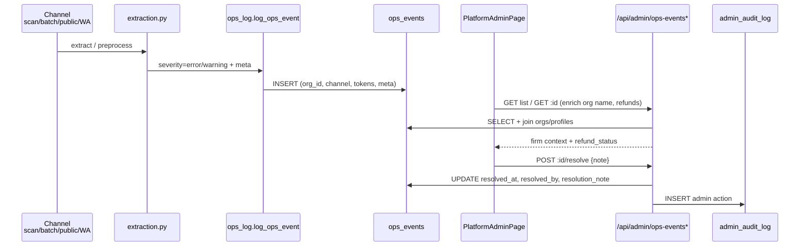

# Platform Admin Ops Suite Implementation Plan

> **For agentic workers:** REQUIRED: Use superpowers:subagent-driven-development (if subagents available) or superpowers:executing-plans to implement this plan. Steps use checkbox (`- [ ]`) syntax for tracking.

**Goal:** Give KhataLens super-admins a complete ops console—failed-scan triage first, then wallet/AI/GSTIN/funnel/channel quality signals, then safe tenant tooling (impersonate, audited credits, suspend reason, bulk test cleanup), then spike alerts—without redesigning pricing or replacing full APM.

**Architecture:** Keep `profiles.is_super_admin` as the sole gate (`verify_super_admin` in `backend/admin_routes.py`). Extend `ops_events` (phase67) with triage/resolution columns and richer instrumentation from existing writers (`ops_log.py`, scan/batch/public/WhatsApp/`extraction.py`, `gstin_service.py`). Add a small `admin_audit_log` + optional `credit_adjustments` trail for admin mutations. Aggregate health endpoints under `/api/admin/*` (service-role reads). Frontend stays on `PlatformAdminPage.tsx` Fog & Copper tabs (Overview | Ops Events | Tenants), adding Health / Alerts panels and drawer actions—every `useQuery` keeps `ErrorState` + Retry. Alerts = lightweight poller (GitHub Actions cron or Supabase `pg_cron` + edge/HTTP ping), not a full observability stack.

**Tech Stack:** React 19, TanStack Query, FastAPI, Supabase (PostgreSQL + service role), existing WhatsApp sender + optional transactional email env vars. Tests: `backend/tests/test_admin_routes.py`, `test_ops_log.py`, Vitest/Playwright only if UI flows need them.

> **Graph note:** `user-code-review-graph` currently reports **0 nodes** in this workspace; paths below are from direct reads of `PlatformAdminPage.tsx`, `admin_routes.py`, `ops_log.py`, `migration_phase67_ops_events.sql`, `credits.py`, `gstin_service.py`.

---

## OUT OF SCOPE

- Credit pack / pricing redesign (`CREDIT_PACKS`, `frontend/src/lib/pricing.ts`, `CREDITS_DOCUMENTATION.md`) — observability + admin adjust only
- Reintroducing `ProGate` or hard Pro feature locks
- Full APM / Sentry / Datadog replacement (tiny optional Sentry hook only if already present)
- Business↔CA bridge product work (`docs/superpowers/specs/2026-07-22-gst-business-ca-bridge-research.md`)
- Changing extraction model selection / trust gates (only read `model_used`, escalate flags already logged)
- Multi-super-admin RBAC matrix beyond `is_super_admin`
- Write-capable impersonation (read-only only)

---

## Current baseline (do not reinvent)

| Area | Today |
|------|--------|
| Auth | `verify_super_admin` → `profiles.is_super_admin` (`backend/admin_routes.py:18-41`) |
| UI | Tabs Overview \| Ops Events \| Tenants (`frontend/src/pages/PlatformAdminPage.tsx`) |
| Ops table | `ops_events` phase67 — severity, channel, org/user/client ids, extraction_state, model, tokens, meta JSONB; RLS service-role only |
| Ops list API | `GET /api/admin/ops-events` filters: severity, channel, event_type |
| Tenants API | `GET /api/admin/tenants` — `q`, `exclude_test`, limit/offset; test heuristic `KhataLens-test*` / `@khatalens-test.com` |
| Quota “suspend” | `POST .../tenants/{id}/update` sets `organizations.credits = 0` (no reason/note) |
| Credits constants | `backend/credits.py` — do not change pack amounts |
| GSTIN | `backend/gstin_service.py` + `gstin_cache` (30-day); no ops events yet |
| Ledger | `transactions` for purchases (`upgrade_user_tier`); no admin adjust audit |
| Writers | `ai_failure`, `ai_primary_failure`, `verify_failure`, `preprocess_failure`, `channel_exception`, `needs_retry`, `low_confidence`, `escalated_to_verify` |

---

## File map (planned)

| File | Responsibility |
|------|----------------|
| `supabase/migrations/migration_phase68_ops_triage.sql` | Triage columns on `ops_events`; indexes |
| `supabase/migrations/migration_phase69_admin_audit_and_suspend.sql` | `admin_audit_log`, org suspend fields, credit adjust RPC |
| `supabase/migrations/migration_phase70_ops_alerts.sql` | Alert state / cooldown table (optional but recommended) |
| `backend/ops_log.py` | Shared logging helpers; new event types for credits/GSTIN |
| `backend/admin_routes.py` | All new admin APIs |
| `backend/admin_metrics.py` *(new, optional split)* | Aggregation queries if `admin_routes.py` grows past ~500 LOC |
| `backend/gstin_service.py` | Cache hit/miss + failure → `log_ops_event` |
| `backend/scan_routes.py`, `batch_routes.py`, `public_routes.py`, `whatsapp_service.py` | Refund/deduct failure meta on existing ops paths where missing |
| `backend/extraction.py` | Ensure tokens/model always present on failure/escalate events |
| `frontend/src/pages/PlatformAdminPage.tsx` | Tabs, drawers, health cards, actions |
| `frontend/src/components/admin/*` *(optional)* | Split OpsEventDrawer, TenantActions, HealthCharts if page > ~900 LOC |
| `backend/tests/test_admin_routes.py`, `test_ops_log.py` | API + logger coverage |
| `.github/workflows/ops-error-spike-alert.yml` *(or Supabase cron)* | Feature #12 poller |

---

## Phased roadmap

| Phase | Features | Outcome |
|-------|----------|---------|
| **P0** | **#1 Failed scan triage** | Operators resolve failures with firm context + refund status |
| **P1** | #2–#7 health signals | Overview becomes real ops dashboard from `ops_events` + org data |
| **P2** | #8–#11 tenant tooling | Safe debug + audited credits + suspend notes + bulk test cleanup |
| **P3** | #12 Alerts | Email/WhatsApp when error severity spikes (~15 min) |

**Dependency rule:** Instrument writers in P0/P1 before trusting Health tab numbers. Do not ship #12 until #1 severity filters and count endpoints exist.

---

## Data flow (ops_events → triage → resolve)

---

## Chunk 1 — P0: Failed scan triage (#1)

### Feature 1: Failed scan triage

**Goal:** From an ops error row, see firm/org context and credit refund status; mark resolved with note; never leave operators guessing which CA was hit.

**Schema / API**

- Migration `migration_phase68_ops_triage.sql`:
  - `resolved_at TIMESTAMPTZ NULL`
  - `resolved_by UUID NULL` (admin profile id)
  - `resolution_note TEXT NULL` (cap 1000 chars in API)
  - Index: `(severity, resolved_at, created_at DESC)` for open-error queues
- Extend `GET /api/admin/ops-events`:
  - Query: `resolved` (`open` \| `resolved` \| `all`, default `open` for severity=error UX)
  - Query: `org_id` optional
- `GET /api/admin/ops-events/{event_id}`:
  - Event + enriched: `org_name`, `company_name`, owner email (auth admin), `client_id` only (no invoice payload)
  - `refund_status`: derive from `meta.refunded` / `meta.credit_outcome` if present, else `"unknown"`
- `POST /api/admin/ops-events/{event_id}/resolve` body `{ "note": "..." }`
- `POST /api/admin/ops-events/{event_id}/reopen` (optional, same phase)

**Instrumentation (minimal for triage value)**

- On refund paths in `batch_routes.py`, `whatsapp_service.py`, `public_routes.py`, `scan_routes.py`: when calling `refund_credits`, also `log_from_ctx` or update meta with `credit_outcome: "refunded"|"deduct_failed"|"no_charge"` on the failure event if already logged—prefer **including flags on the same failure event** via `meta` at log time rather than a second row.
- Files: `backend/batch_routes.py`, `backend/whatsapp_service.py`, `backend/public_routes.py`, `backend/scan_routes.py`, `backend/ops_log.py`

**UI** (`PlatformAdminPage.tsx` Ops tab)

- Row click → drawer: severity, type, channel, message, model, tokens, extraction_state, org name, email, refund badge, Resolve form
- Filters: Open / Resolved / All; keep severity + channel
- Overview “Recent Ops” links into drawer when possible

**Tests**

- `test_admin_routes.py`: resolve requires super admin; non-admin 403; resolve sets fields; list `resolved=open` excludes resolved
- `test_ops_log.py`: meta accepts `credit_outcome`

**Dependencies:** None (first feature). Unblocks #12 counts and #7 quality views.

**Risks:** PII creep (never put invoice totals / GSTIN values in ops message); auth email fetch is already used by tenants list—reuse carefully; orphan `org_id` null events stay showable with “Unknown firm”.

### Task checklist — P0

- [x] **Step 1:** Write failing tests for resolve + open filter in `backend/tests/test_admin_routes.py`
- [x] **Step 2:** Add `migration_phase68_ops_triage.sql` and document apply order after phase67
- [x] **Step 3:** Implement enrich + resolve endpoints in `backend/admin_routes.py`
- [x] **Step 4:** Add `credit_outcome` to failure log sites (batch/scan/public/WhatsApp) where refunds happen
- [x] **Step 5:** Ops drawer + filters in `PlatformAdminPage.tsx` with `ErrorState`/`Retry`
- [x] **Step 6:** Run `pytest backend/tests/test_admin_routes.py backend/tests/test_ops_log.py -v`
- [ ] **Step 7:** Commit `feat(admin): failed scan triage resolve flow`

---

## Chunk 2 — P1: Observability (#2–#7)

Shared UI: add **Health** sub-panel on Overview (or fourth tab `health`) fed by `GET /api/admin/health-summary?window=24h|7d`.

### Feature 2: Wallet / credit health

**Goal:** Surface low org balances, spend spikes, refund volume, failed deducts—without changing pack pricing.

**Schema / API**

- Prefer ops instrumentation over new tables:
  - Log `event_type=credit_deduct_failed` (severity=error) when `decrement_credits` returns -1 / errors
  - Log `event_type=credit_refund` (info, sampled OK) or count refunds via meta on failures
- `GET /api/admin/health/credits`:
  - `low_balance_orgs`: orgs with `credits < threshold` (env `ADMIN_LOW_CREDIT_THRESHOLD` default 20), exclude test names
  - `refund_events_24h`, `deduct_failed_24h` from `ops_events`
  - `spend_spike_orgs`: orgs whose invoice/ops volume in window is > N× their 7d daily avg (simple SQL/service-role aggregation; start with ops `channel` counts + org credits delta via `organizations.updated_at` if needed)
- Optional later: `credit_ledger` table—**defer** unless aggregation is too weak; YAGNI until P1 review

**Files:** `admin_routes.py`, channel routes that call `decrement_credits`, `PlatformAdminPage.tsx`, `credits.py` (**read constants only**, e.g. label costs—do not edit pack amounts)

**UI:** Cards — Low wallets | Refunds 24h | Failed deducts | Spike list (link to Tenants `q=`)

**Tests:** Mock org rows + ops counts; threshold filter excludes `khatalens-test`

**Dependencies:** Benefits from #1 meta conventions; independent of #8–11

**Risks:** False spikes on new orgs (use min baseline volume); do not expose payment_id / Razorpay secrets

---

### Feature 3: AI cost & escalate rate

**Goal:** Replace Overview’s naive `total_invoices * 0.065` with estimates from real `ops_events.model_used` + `tokens_used`, plus escalate rate (`escalated_to_verify` / total extracts logged).

**Schema / API**

- Ensure writers always set `model_used` / `tokens_used` on success-quality and failure paths (`extraction.py`, `log_extraction_quality`)
- `GET /api/admin/health/ai`:
  - Tokens/day, events by `model_used` (mini vs gpt-4o / gemini labels as stored)
  - `escalate_rate` = count(`escalated_to_verify`) / count(info+warning extract events) in window
  - `estimated_cost_inr`: **configurable** rates in env (`AI_COST_PER_1K_TOKENS_MINI`, `AI_COST_PER_1K_TOKENS_VERIFY`)—document defaults; do not invent fake precision
- Update `GET /api/admin/metrics` to include `ai_tokens_24h` and deprecate hard-coded 0.065 as primary (keep as fallback subtitle if no ops data)

**Files:** `extraction.py`, `ops_log.py`, `admin_routes.py`, `PlatformAdminPage.tsx` MetricCard

**UI:** Mini vs verify split bar; escalate %; tokens/day

**Tests:** Aggregation with fixture ops rows differing by model

**Dependencies:** Dense enough ops sampling (`OPS_LOG_SAMPLE_RATE`); errors always logged today

**Risks:** Info sampling undercounts “successful cheap” scans—document that escalate rate is ops-based not 100% traffic; optionally force-log one `scan_success` info at low sample only

---

### Feature 4: GSTIN verify failures / cache miss rate

**Goal:** Visibility into AppyFlow cost/reliability via cache miss vs hit and API failures.

**Schema / API**

- In `gstin_service.verify_gstin`:
  - On cache hit (fresh): optional sampled `event_type=gstin_cache_hit` (info) **or** increment-only counter table—prefer ops with high sample skip: log **misses and failures always**, hits at `OPS_LOG_SAMPLE_RATE`
  - Cache miss / expired → `gstin_cache_miss` (info)
  - Timeout / exception / Unknown from API → `gstin_verify_failure` (warning/error)
  - Meta: `{ "cache": "hit"|"miss"|"expired", "status": "Active"|... }` — **never** store legal_name in ops (PII/business identity)
- `GET /api/admin/health/gstin`: miss rate, failure count, window

**Files:** `backend/gstin_service.py`, `admin_routes.py`, `PlatformAdminPage.tsx`, `backend/tests/` (new `test_gstin_service.py` or extend existing)

**UI:** Cache miss % | Verify failures 24h

**Dependencies:** Independent

**Risks:** High volume of hits if over-logged—enforce sampling; do not log raw GSTIN in `message` (hash last 4 only if needed for debug: `gstin_suffix`)

---

### Feature 5: Signup funnel

**Goal:** New orgs/day and stuck funnels: 0 clients / 0 invoices.

**Schema / API**

- `GET /api/admin/health/funnel?days=7`:
  - `orgs_created_per_day` from `organizations.created_at`
  - `zero_client_orgs`, `zero_invoice_orgs` (join `clients` / `invoices` or `tenant_usage`) excluding test heuristics
- No new tables

**Files:** `admin_routes.py`, Overview UI

**UI:** Sparkline or simple table (date → count); list of zombie orgs (limit 20) with Open in Tenants

**Tests:** Fixture orgs with/without clients

**Dependencies:** Test-tenant exclusion shared helper (`_is_test_tenant`)

**Risks:** Counting profiles vs organizations—**prefer organizations** as firm unit; document if owner-less edge cases appear

---

### Feature 6: Channel mix

**Goal:** Volume + error rate by `scan` | `batch` | `public` | `whatsapp`.

**Schema / API**

- `GET /api/admin/health/channels?window=24h`:
  - Per channel: total events, error count, error_rate
  - Driven entirely by `ops_events.channel` + `severity`

**Files:** `admin_routes.py`, Overview / Health

**UI:** Four small stats + error rate badges

**Tests:** Mixed channel fixtures

**Dependencies:** Channels already validated in `ops_log.VALID_CHANNELS`

**Risks:** Volume ≠ successful scans (ops bias toward failures/warnings)—label UI “Ops-weighted volume” honesty

---

### Feature 7: Duplicate / needs_retry rates

**Goal:** Extraction quality from `extraction_state` and existing event types.

**Schema / API**

- Confirm scan path sets `duplicate_warning` on `Extraction_State` (`scan_routes.py`) and logs via `log_extraction_quality` or dedicated `event_type=duplicate_warning`
- If not logged today: add warning log when state is duplicate-related
- `GET /api/admin/health/quality`: rates for `needs_retry`, `needs_review`, duplicate signals, avg `confidence_score`

**Files:** `scan_routes.py`, `ops_log.py`, `admin_routes.py`, UI

**UI:** Quality strip on Health

**Tests:** Ops rows with extraction_state values

**Dependencies:** #1 list filters by event_type already exist

**Risks:** State vocabulary drift—centralize allowed states in one constant module if not already

### Task checklist — P1

- [x] **Step 1:** Add failing tests for `/api/admin/health/*` aggregations
- [x] **Step 2:** Instrument credit deduct failures + GSTIN miss/fail logs
- [x] **Step 3:** Implement health endpoints (single router section or `admin_metrics.py`)
- [x] **Step 4:** Replace Overview cost card to prefer token-based estimate
- [x] **Step 5:** Build Health UI section with ErrorState on the health query
- [x] **Step 6:** `pytest` admin + gstin + ops_log; manual smoke on `/app/admin`
- [ ] **Step 7:** Commit `feat(admin): ops health dashboard signals`

---

## Chunk 3 — P2: Tenant tooling (#8–#11)

### Feature 8: Impersonate / open as firm (read-only)

**Goal:** Debug tenant UX without password sharing.

**Schema / API**

- Prefer **magic link / session exchange** that is read-only:
  - `POST /api/admin/tenants/{tenant_id}/impersonate` → returns short-lived token **or** redirects URL
  - Implementation options (pick one in implementation; recommend A):
    - **A (recommended):** Generate Supabase `auth.admin.generate_link` type `magiclink` for tenant user; open in new tab; force UI banner “Read-only support session” via `localStorage.khatalens_support_mode=1` set by `/app/support-enter?token=...` route that only sets flag + signs in
    - **B:** Custom JWT claim `support_readonly` — heavier; avoid unless A insufficient
- Server-side: block write routes when support mode header/claim present **or** rely on UI disable + audit (defense in depth: middleware check on mutating `/api/*` if claim present)
- Always write `admin_audit_log` action `impersonate_start`

**Files:** New migration audit table (shared with #9/#10), `admin_routes.py`, `frontend/src/App.tsx` route, banner in main layout, `utils.get_current_user` optional claim check

**UI:** Tenants action “Open as firm (read-only)” → confirm → new tab

**Tests:** Non-admin 403; audit row created; mutating API rejected in readonly mode (at least one representative route)

**Dependencies:** #9’s `admin_audit_log` can land in same migration

**Risks:** Highest security risk in suite—time-box tokens (≤15 min), never impersonate another super-admin, require re-auth confirm, log IP if available

---

### Feature 9: Manual credit adjust + visible audit trail

**Goal:** Replace opaque `prompt()` quota edit with delta adjust + reason, visible history.

**Schema / API**

- `migration_phase69_admin_audit_and_suspend.sql`:
  - `admin_audit_log (id, created_at, admin_user_id, action, target_org_id, target_user_id, before_json, after_json, note)`
  - RPC or service-role update: `admin_adjust_org_credits(org_id, delta, admin_id, note)` ensuring non-negative floor unless explicit allow
- `POST /api/admin/tenants/{tenant_id}/credits` body `{ "delta": int, "note": str }` (resolve org via `resolve_active_org_id`)
- `GET /api/admin/tenants/{tenant_id}/credit-audit?limit=`
- Deprecate raw “set absolute quota” or keep as advanced with mandatory note

**Files:** `admin_routes.py`, migration, `PlatformAdminPage.tsx` (modal not `prompt`), optionally Wallet page read-only of admin notes—**admin UI only** this phase

**UI:** Adjust Credits modal: current balance, delta, note (required ≥5 chars), submit; Audit drawer

**Tests:** Delta +40/-5; note required; audit trail order; 403 for non-admin

**Dependencies:** None beyond audit table; complements #2

**Risks:** Race with concurrent `decrement_credits`—use SQL `UPDATE ... RETURNING` in one RPC; never use negative `decrement_credits` as adjust

---

### Feature 10: Suspend reason + note

**Goal:** Suspension is not “quota=0” alone—store reason, note, who/when; block scans with clear message.

**Schema / API**

- On `organizations` (or `profiles` if org-less—prefer org):
  - `suspended_at TIMESTAMPTZ`
  - `suspended_by UUID`
  - `suspend_reason TEXT` (enum-ish: `nonpayment`, `abuse`, `request`, `other`)
  - `suspend_note TEXT`
- `POST /api/admin/tenants/{tenant_id}/suspend` `{ reason, note }`
- `POST /api/admin/tenants/{tenant_id}/unsuspend` `{ note }`
- Enforcement: early check in `scan_routes`, `batch_routes`, WhatsApp, public upload resolve-org path → 403 `Firm suspended`
- Stop treating quota=0 as sole suspend; keep low-credits UX separate

**Files:** migration phase69, `admin_routes.py`, channel entrypoints, Tenants UI

**UI:** Suspend modal with reason select + note; badge on tenant row

**Tests:** Suspended org cannot scan; unsuspend restores; audit entries

**Dependencies:** Shares audit log with #9; do before #11 bulk delete safety

**Risks:** Existing “Suspend (Quota=0)” must migrate UX to new endpoint to avoid confusion

---

### Feature 11: Bulk delete/archive test firms

**Goal:** Clear `KhataLens-test*` / `@khatalens-test.com` noise safely.

**Schema / API**

- `POST /api/admin/tenants/bulk-archive-tests` body `{ "confirm": "DELETE_TEST_FIRMS", "dry_run": bool }`
- Match server-side `_is_test_tenant` + company pattern; **hard deny** if email domain is not test and name doesn’t match
- Prefer **archive** flag `organizations.is_test_archived` soft-hide first; hard delete auth user only when `dry_run=false` and confirm string matches
- Reuse `DELETE /tenants/{id}` carefully—document cascade expectations
- Cap batch size (e.g. 50 per call)

**Files:** `admin_routes.py`, Tenants toolbar, tests with only test-pattern fixtures

**UI:** “Clean test firms…” → dry-run preview count → confirm type phrase

**Tests:** Never deletes `acme.com` even if company contains “test”; dry_run returns ids without delete

**Dependencies:** #10 (don’t wipe suspended real firms mis-tagged); relies on existing exclude_test heuristics

**Risks:** Catastrophic delete—mandatory dry_run default true; double confirm; audit every id

### Task checklist — P2

- [x] **Step 1:** Migration phase69 (audit + suspend columns + credit adjust RPC)
- [x] **Step 2:** Failing tests for credits adjust, suspend enforcement, bulk dry-run
- [x] **Step 3:** Implement APIs + scan/batch/WA/public suspend guards
- [x] **Step 4:** Impersonate read-only path + support banner
- [x] **Step 5:** Replace tenant `prompt`/`confirm` with modals; bulk clean UI
- [x] **Step 6:** Full admin pytest + manual impersonation smoke
- [ ] **Step 7:** Commit `feat(admin): tenant tooling audit suspend impersonate bulk-test`

---

## Chunk 4 — P3: Alerts (#12)

### Feature 12: Alerts on error severity spikes (~15 min)

**Goal:** Email and/or WhatsApp platform ops when `severity=error` count in a rolling ~15 minute window exceeds threshold.

**Schema / API**

- `migration_phase70_ops_alerts.sql`: `ops_alert_state (id, alert_key, last_fired_at, last_count, meta)` for cooldown
- `GET /api/admin/alerts/status` — current window count, threshold, last fired (for UI)
- `POST /api/admin/alerts/check` — **secret-protected** (`X-Ops-Alert-Secret` or GitHub OIDC) so cron can hit without user JWT; still not public
- Logic:
  - Count `ops_events` where `severity='error'` and `created_at > now()-interval '15 minutes'`
  - If `count >= OPS_ERROR_SPIKE_THRESHOLD` (default 10) AND cooldown elapsed (`OPS_ALERT_COOLDOWN_MIN` default 30):
    - Send email (env `OPS_ALERT_EMAIL`, provider already used in project—or SMTP/Resend if present; if none, log + WhatsApp-only)
    - Send WhatsApp to `OPS_ALERT_WHATSAPP_TO` via existing `send_whatsapp_message`
    - Update `ops_alert_state`
- Cron: `.github/workflows/ops-error-spike-alert.yml` every 10–15 min calling Render/backend URL (mirrors `keep-backend-awake.yml` pattern)

**Files:** `admin_routes.py` or `backend/ops_alerts.py`, WhatsApp helper, workflow YAML, Overview alert status chip in `PlatformAdminLayout.tsx` (“Status: All Systems Normal” → dynamic)

**UI:** Health/Overview shows last spike check; link to Ops filtered severity=error&resolved=open

**Tests:** Threshold fire once; cooldown suppresses second; secret missing → 401

**Dependencies:** #1 open-error queue; P1 channel health nice-to-have for message body

**Risks:** Alert storms—cooldown mandatory; exclude test org events if `org_id` matches test firms; don’t put PII in WhatsApp body (counts + top event_types only)

### Task checklist — P3

- [x] **Step 1:** Tests for spike check + cooldown
- [x] **Step 2:** Migration + `ops_alerts.py` + secured endpoint
- [x] **Step 3:** Wire email/WhatsApp env vars; document in backend `.env.example` if present
- [x] **Step 4:** GitHub Actions (or pg_cron) schedule
- [x] **Step 5:** Dynamic status in `PlatformAdminLayout.tsx`
- [ ] **Step 6:** Staging fire test with threshold=1 then restore
- [ ] **Step 7:** Commit `feat(admin): ops error spike alerts`

---

## Cross-cutting standards (every feature)

- [ ] Gate every new route with `Depends(verify_super_admin)` except cron `alerts/check` (shared secret)
- [ ] Every new `useQuery` on admin UI: destruct `isError`, render `<ErrorState onRetry={...} />`
- [ ] No `allow_origins=["*"]` changes; no `dangerouslySetInnerHTML`
- [ ] Ops messages stay non-PII (existing `ops_log` contract)
- [ ] Do not edit `CREDIT_PACKS` amounts or reintroduce ProGate
- [ ] Prefer extending `admin_routes.py` until file unwieldy, then split `admin_metrics.py` / `ops_alerts.py`
- [ ] Apply migrations in order: 68 → 69 → 70 after phase67

---

## Suggested implementation order (agents)

1. P0 #1 triage (schema + resolve + drawer + refund meta)
2. P1 instrumentation (#4 GSTIN, credit fail logs) then health APIs (#2,#3,#5,#6,#7)
3. P2 audit migration then #9 → #10 → #8 → #11
4. P3 #12 alerts + layout status

---

## Definition of done

- All 12 features have API + UI surface (or cron for #12) and tests for happy path + authz denial
- Overview Health reflects real `ops_events` / org data
- Operators can triage an open error to resolved with firm context
- Credit adjusts and suspends leave `admin_audit_log` rows
- Test bulk clean supports dry-run and refuses non-test tenants
- Spike alert fires once per cooldown in staging
- Pricing docs / packs untouched

---

## Execution handoff

Plan complete and saved to `docs/superpowers/plans/2026-07-22-platform-admin-ops-suite.md`.

**Ready to execute?** Use **superpowers:subagent-driven-development** (fresh subagent per task + two-stage review). Start with Chunk 1 / Feature #1 only.
