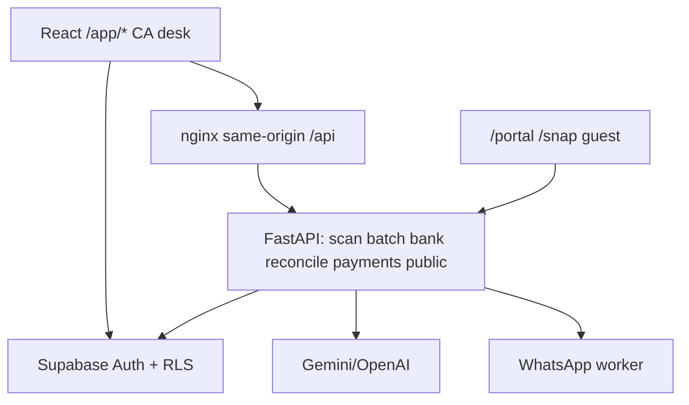
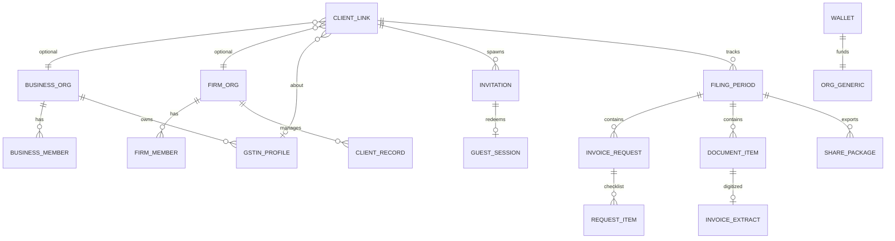
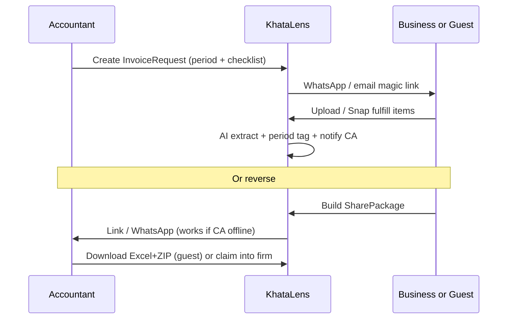

# Research Brief: KhataLens as Business ↔ CA GST Collaboration Bridge

**Date:** 2026-07-22  
**Status:** Research only — no implementation  
**Audience:** Parent agent + founder brainstorming  
**Sources:** Product codebase/docs (`App.tsx`, org/RBAC migrations, portal/snap flows, `CREDITS_DOCUMENTATION.md`, architecture audit 2026-07-21, Option 5 brand, `Thoughts.md`); India GST workflow & competitor scan (2026 ITC/IMS context, Clear/Zoho/Vyapar/Khatabook/Tally-adjacent, CA practice portals).

> **Note on knowledge graph:** `user-code-review-graph` was queried first (`get_architecture_overview`, `list_communities`, `semantic_search_nodes`, `list_graph_stats`). The workspace graph currently has **0 nodes** (empty / never successfully persisted in this environment). Architecture context below therefore falls back to product docs and direct IA/schema reads. Graph rebuild was attempted; treat structural claims as doc/code-backed, not graph-backed.

---

## 1. Executive snapshot

KhataLens today is a **CA-firm desk product** (org wallet, multi-client scan, GSTR-2B/bank recon) with a thin **one-way guest upload bridge** (`/portal/:clientId`, `/snap/:clientId` + signed token). The founder vision is a **collaboration bridge** that SMEs and accountants both need for monthly GST data handoff — including when the other party is **not** on the product.

**Strongest opportunity:** Own the *period-scoped invoice collection + structured package + status of what’s still missing* layer that sits between merchant billing apps and CA filing utilities — WhatsApp-native, works offline for one side, and reuses existing AI scan/recon strengths.

**Recommended direction (for discussion, not locked):** **Bridge-first with external invite / share packages** (Approach B), seeded from today’s portal/snap, with business-home and CA-home as first-class modes — not dual-login-required platform lock-in (Approach A), and not “business app that vaguely invites CA later” without CA request loops (Approach C alone).

---

## 2. Current product reality vs desired vision (gap)

### 2.1 What exists today

| Layer | Reality |
|-------|---------|
| **Positioning / brand** | Explicitly **Indian CA GST desk** (Fog & Copper Seal). Landing/JSON-LD still speak to CAs; Option 5 docs call out CA month-end desks. |
| **Tenancy** | `organizations` + `organization_members` (owner/admin/accountant); wallet on `organizations.credits`. `clients` hang off firm org. Firm-wide `has_client_access` is product default. |
| **Core value** | AI invoice scan, batch ZIP, WhatsApp intake (CA-linked number), GSTR-2B recon, bank stmts/match, tax liability, Virtual CFO — **credits-only** gating (no ProGate). |
| **“Business” mode** | `localStorage.accountType === 'business'` only renames Clients → Businesses and soft-copy on Dashboard chooser. **Same shell, same data model, not a dual-sided product.** |
| **Collaboration today** | CA shares magic-link portal/snap → guest uploads → AI into **CA’s client inbox**. Token hardening noted as P1 in architecture audit. **No** invoice *requests*, **no** “what CA still needs,” **no** business-owned package export to offline CA, **no** CA↔business identity link. |
| **Credits** | Packs: Starter ₹2,499/1k · Pro ₹7,999/5k. Spend: scan/WhatsApp/public upload 1; bank/deep-match scaled. Founder note (`Thoughts.md`): redesign needed for scan + statement check + **GSTIN verify ~₹0.50** + hosting + storage + WhatsApp + other COGS. |

Architecture (from audit):

### 2.2 Desired vision (founder)

1. Primary user: **small businesses** (not CAs-only).  
2. Product as **collaboration bridge** between businesses who need GST filed and accountants who file.  
3. Business can scan and **send data to accountant whether or not accountant uses KhataLens**.  
4. Accountant can **request invoices from business whether or not business uses KhataLens**.  
5. Become **necessary** for smooth monthly handoff (habit + workflow lock-in).  
6. Credit system must reflect real COGS (AI, verify APIs, WhatsApp, storage, hosting).

### 2.3 Gap summary

| Desired | Gap |
|---------|-----|
| Business-first home | Soft label only; IA is CA practice groups (Today / Reconcile / Practice) |
| Bidirectional collaboration | Only CA→guest upload |
| Works when other party offline | Partial: guest upload if CA on product; **no** share package / Excel+PDF handoff for offline CA; **no** WhatsApp request checklist for offline business |
| Period checklist & reminders | Not productized (status quo remains WhatsApp chaos) |
| Who pays for AI / WhatsApp / storage | Org wallet assumes CA firm buyer; SME payer & sponsorship models undefined |
| Trust / ownership | Data owned by firm org; business has no durable account of record |

---

## 3. Market / workflow research (India GST)

### 3.1 How handoff works today (status quo)

Typical SME ↔ CA loop for monthly GST:

1. Business generates sales in **Tally / Vyapar / Marg / Excel / WhatsApp photos**.  
2. Purchase bills arrive as **WhatsApp images**, paper, email PDFs, Drive folders named `GST July`.  
3. CA chases via WhatsApp: “bhejo invoices,” “2B mein nahi aa raha,” “bank statement bhejo.”  
4. CA builds purchase register (manual / OCR / Excel), matches **GSTR-2B**, prepares **GSTR-1 / 3B**, files on portal (often Clear / ExpressGST / GSP / manual).  
5. Missing supplier filings → ITC stuck; business blames CA; CA blames vendors.

**Channels that “win” today:** WhatsApp (ubiquity), Google Drive (bulk), email (formal), Excel (CA comfort). Any bridge that ignores WhatsApp will lose SMEs.

### 3.2 Pain points (both sides)

**Business (SME)**

- Doesn’t know *what* CA still needs for *this* period.  
- Photos scattered across phones/staff; duplicates and missing bills.  
- ITC blocked / reduced when suppliers don’t file GSTR-1 (2026 **IMS + GSTR-3B ITC hard-block** narrative makes this existential, not administrative).  
- No visibility into filing readiness (“are we complete?”).  
- Paying CA fees while still doing unpaid document logistics.

**Accountant / CA**

- 40–70% of GST month time is **collection & chase**, not technical filing.  
- Unstructured WhatsApp dumps; wrong period; no audit trail.  
- 2B vs books mismatches; vendor follow-ups.  
- Multiple tools: books (Tally), filing (Clear), practice chase (WhatsApp), OCR (ad hoc).  
- Client doesn’t respond until deadline day.

### 3.3 Competitor / adjacent map (what they do / don’t for collaboration)

| Category | Examples | Strength | Collaboration gap |
|----------|----------|----------|-------------------|
| **GST filing utilities** | Clear (ClearTax), ExpressGST, Saral | Bulk recon, portal/GSP filing, CA volume | Weak SME↔CA document ops; not a WhatsApp-native handoff OS |
| **Full books + GST** | Zoho Books (+ Practice), Tally ecosystem | Invite accountant into *books*; file from books | Requires both in same books stack; heavy for micro-SME; not “send package to any CA” |
| **SME billing / ledger** | Vyapar, Khatabook, Marg | Fast billing / khata for merchants | Poor professional handoff to arbitrary CA; not recon desk |
| **CA practice OS** | QwikCA, CA OMS, TatvaBooks, PracticeStacks, Entries | Client portal, reminders, tasks, WhatsApp templates | Often firm-centric; portals usually need client login; light on AI invoice→structured GST package; filing still elsewhere |
| **Recon specialists** | AccubrAI-class 2B matchers | Fuzzy match, vendor WhatsApp PDFs | Optimize CA recon, not bidirectional bridge / offline-CA export |

**Whitespace for KhataLens:**  
*Structured, period-bound invoice exchange + AI extraction + readiness status*, that **does not require both parties on the same full stack**, and plugs into whatever the CA already files with.

### 3.4 Must-have vs nice-to-have in this niche

**Must-have (habit / necessity)**

- Period checklist: “July purchases — 12 received / 3 requested / 2 overdue.”  
- One-tap send / request via **WhatsApp or magic link**.  
- Structured data CA can open without KhataLens (Excel + originals ZIP + summary PDF).  
- Duplicate detection & period tagging.  
- Trust: who uploaded what, when (audit trail).

**Nice-to-have (later moat)**

- Deep GSTR-2B AI match inside the bridge.  
- Bank match, Virtual CFO, tax liability.  
- Full practice management (HR, billing, DSC vault).  
- Direct GSP filing.

**What makes a tool “necessary”:** It becomes the **shared source of truth for “documents for period P”** — replacing the WhatsApp thread as system of record. Filing engines and billing apps remain; the bridge owns the *handoff*.

---

## 4. Stakeholder jobs-to-be-done

### Business

1. **When** month-end approaches, **I want** a single place that tells me what my CA still needs, **so** I don’t get last-day panic calls.  
2. **When** I get a bill, **I want** to snap/upload it in &lt;30s, **so** it’s already with my CA’s July folder.  
3. **When** my CA doesn’t use fancy software, **I want** to send a clean package (Excel + files), **so** they can still file.  
4. **When** ITC is at risk, **I want** visibility into missing supplier invoices, **so** I can chase vendors (or ask CA to).

### Accountant / CA

1. **When** I start a client’s GST month, **I want** to request a checklist in one tap (WhatsApp/email), **so** I stop rewriting the same message.  
2. **When** documents arrive, **I want** them digitized & period-tagged, **so** juniors don’t retype.  
3. **When** the client isn’t on any portal, **I want** guest links that still land in the right client/period, **so** collection doesn’t depend on their signup.  
4. **When** I’m ready to file (in Clear/Tally/portal), **I want** export-ready PR + unmatched list, **so** KhataLens doesn’t trap my workflow.

---

## 5. Collaboration matrix (4 cases)

| Case | Business on KL | CA on KL | Product behavior |
|------|----------------|----------|------------------|
| **Both on** | ✅ | ✅ | Linked `ClientLink`: shared period board, live status, in-app requests, shared audit; optional dual wallets / sponsorship |
| **Business only** | ✅ | ❌ | Business builds **Share Package** (structured extract + files + period summary) → WhatsApp/email/Drive link; magic “claim” if CA later signs up |
| **CA only** | ❌ | ✅ | CA creates **Invoice Request** → WhatsApp/email magic link → guest Snap/Portal upload into client+period (today’s portal evolved); reminders until complete |
| **Neither on** | ❌ | ❌ | Lightweight **ephemeral room** (link-only, no accounts): both use guest UX; data TTL + export; convert-to-account CTAs. Highest abuse/cost risk — constrain or delay |

**Implication:** Dual-sided lock-in (both must be on) fails founder requirement. Bridge + packages cover cases 2–3; case 4 is optional Phase 2+ with strict rate limits.

---

## 6. Architecture approaches (2–3) + recommendation

### Approach A — Dual-sided platform (both must be on)

**Idea:** Business org + Firm org + mandatory link; all requests/sends inside app.

| Pros | Cons |
|------|------|
| Cleanest permissions & RLS | Breaks “whether or not other uses SaaS” |
| Highest LTV if both convert | Cold-start: SME won’t join because CA won’t; CA won’t because SME won’t |
| Easy in-app status | Competes with Zoho “invite accountant” without books depth |

**Fit:** Poor as *primary* bet for stated vision.

### Approach B — Bridge with external invite (WhatsApp / email magic links + share packages) — **RECOMMENDED**

**Idea:** First-class objects: **Invitation**, **ClientLink** (optional when both exist), **InvoiceRequest**, **SharePackage**. Any side can initiate; other side can be guest.

| Pros | Cons |
|------|------|
| Matches founder vision & India WhatsApp reality | Token/abuse surface (already flagged for public upload) |
| Extends existing `/portal` + `/snap` | Dual UX (app vs guest) to polish |
| CA-only and business-only both work Day 1 | “Neither” needs careful TTL/cost |
| Moat = period readiness graph, not filing | Must nail exports for offline CA |

**Seed in codebase:** CollaborationPortal, SnapPage, public upload + upload tokens, WhatsApp scan worker, clients/orgs.

### Approach C — Business-first; accountant as guest/collaborator

**Idea:** SME owns org & wallet; CA is invited collaborator or receives packages only.

| Pros | Cons |
|------|------|
| Aligns “primary = small business” | CA firms (current product DNA & buyers) feel demoted |
| Clear data ownership for SME | Firm multi-client workflows harder if firm isn’t first-class tenant |
| Natural for self-filing SMEs who later hire CA | Credits: SME may underfund AI used by CA |

**Fit:** Good *positioning* and ownership default **inside** Approach B (business can own link; firm can own link — “link initiator pays” or sponsorship). Weak as exclusive architecture if CA acquisition remains important.

### Recommendation

**Ship Approach B as the system of record for handoff**, with **asymmetric tenancy**:

- Firm org remains first-class (don’t throw away CA desk).  
- Business org becomes first-class (not localStorage).  
- `ClientLink` connects them when both exist.  
- Guest paths always available.  
- Default data ownership: **business GSTIN’s documents belong to the Business org when business is on-product; otherwise to the Firm client record that collected them**, with explicit transfer on claim/link.

Positioning shift: from “CA desk with upload link” → **“GST handoff OS for SME ↔ CA”** (brand can stay Fog & Copper; copy must stop being CA-only).

---

## 7. Proposed domain model (logical)

### Entities (sketch)

| Entity | Role |
|--------|------|
| **BusinessOrg** | SME tenant; owns GSTIN(s), business home, optional wallet |
| **FirmOrg** | CA practice; multi-client desk (today’s `organizations`) |
| **GstinProfile** | Legal entity identity (GSTIN, trade name) |
| **ClientRecord** | Firm’s view of a taxpayer (today’s `clients`) |
| **ClientLink** | Bridge between BusinessOrg ↔ FirmOrg (± GSTIN); status active/pending/revoked |
| **Invitation** | Email/WhatsApp/magic-link to join or guest-fulfill |
| **FilingPeriod** | e.g. `2026-07` per GSTIN; readiness state |
| **InvoiceRequest** | CA- or system-initiated ask: purchases / sales / bank / specific vendors |
| **RequestItem** | Checklist line + due + channel |
| **DocumentItem** | Uploaded file + period + source (app/guest/WhatsApp) |
| **InvoiceExtract** | AI fields (existing invoice model evolved) |
| **SharePackage** | Immutable export artifact: Excel + ZIP + PDF summary + checksum; link TTL |
| **GuestSession** | Signed token scope: upload-to-period / fulfill-request / download-package |
| **Wallet** | Credits at org level; sponsorship / recharge rules |

### Roles & trust boundaries

| Role | Can |
|------|-----|
| Business owner/staff | Upload, respond to requests, create packages, see “what CA needs,” manage link |
| Firm owner/admin/accountant | Create requests, open guest links, recon tools, export, multi-client |
| Guest (token) | Only scoped action (upload / download package); no list other clients |
| Platform admin | Existing super-admin |

**RLS sketch:**  
- Firm members → firm clients (current firm-wide model).  
- Business members → own GSTIN docs.  
- Linked parties → shared period board via `ClientLink` grants.  
- Guests → **never** PostgREST direct; always FastAPI token validation + service role with budgets (harden public upload further).

**Notification channels:** WhatsApp **priority** (India), email secondary, in-app tertiary. Template categories: request sent, reminder, package ready, period incomplete, duplicate rejected.

---

## 8. Information architecture / key screens

### Business home (primary pivot surface)

1. **Today / This period** — “Your CA needs 3 more purchase bills for July” + CTA Snap / Upload.  
2. **Requests inbox** — open checklist from CA (or self-created package tasks).  
3. **Send to accountant** — choose linked CA *or* “export package / share link.”  
4. **My documents** — period filter, duplicates, confidence.  
5. **Accountant** — link status, invite CA, revoke.  
6. **Wallet** — if business pays.

### Accountant home (evolve current Dashboard)

1. **Collection board** — clients × period: % complete, overdue requests.  
2. **Request invoices** — template checklist → WhatsApp/email.  
3. **Inbox / Scan** — existing AI desk.  
4. **Reconcile** — existing 2B/bank (post-collection).  
5. **Clients & links** — portal links, Snap QR, business claim status.  
6. **Wallet** — firm pays (default today).

### Shared flows

### Status UX (necessity loop)

- Business: **“What my CA still needs from me”** (always visible).  
- CA: **“What’s blocking filing for client X”** (collection, not portal login).

---

## 9. Monetization / credits implications

### Current model

Prepaid org credits; AI actions metered; packs ~₹2.5–₹1.6 per credit at list. Public/guest upload already burns firm credits (post/pre deduct policies evolving).

### Bridge COGS to price (from `Thoughts.md` + product)

| Cost driver | Implication |
|-------------|-------------|
| Invoice / statement AI | Keep metered; consider cheaper “storage-only upload” vs “extract now” |
| Statement check / deep match | Already scaled; expose honestly on Pricing |
| GSTIN verification ~₹0.50 | New credit line or paisa-accurate pass-through + margin |
| WhatsApp Business API | Per-template message credits or bundled “outreach packs” |
| Hosting + storage | Period retention tiers; package CDN bandwidth; don’t infinite-store guest rooms |
| Guest abuse | Rate limits, CAPTCHA, per-link budgets, firm/business prepaid reserve |

### Who pays (hypotheses — founder choice)

1. **Firm sponsors collection** (default today): CA wallet pays guest AI; sticky for practice.  
2. **Business pays capture** (business-first): SME wallet; CA recon optional add-on.  
3. **Split:** Upload/extract = business or requester; recon/deep-match = firm.  
4. **Sponsorship credit:** Firm gifts N credits/month per linked client (relationship monetization).

**Recommendation for brainstorming:** Default **requester pays for outreach + guest extract**; **processor pays for recon**; allow firm sponsorship toggle per client. Redesign packs around *handoff units* (e.g. “100 document captures + 200 WhatsApp reminders”) not only “AI credits” abstractly.

---

## 10. What NOT to build yet (YAGNI)

| Defer | Why |
|-------|-----|
| Full GSP / direct GSTR-1/3B filing | Crowded (Clear et al.); not required for handoff necessity; huge compliance liability |
| Full practice management (HR, DSC vault, proposals) | QwikCA/CA OMS territory; dilutes bridge |
| Full accounting / inventory (Vyapar/Tally replacement) | Wrong war for MVP |
| IMS accept/reject automation at portal depth | Valuable later; depends on GSP |
| “Neither on” ephemeral rooms at scale | Abuse & support cost; wait until CA-only + business-only proven |
| Multi-country tax | India GST focus |
| Rebuilding brand system | Option 5 locked; only reposition *copy/IA*, not tokens |

**Do build early:** requests, period readiness, packages/exports, WhatsApp templates, dual org types, harden tokens.

---

## 11. Risks & open questions (for parent to ask founder, one-at-a-time)

### Risks

1. **Identity confusion** — two homes; wrong default signup path.  
2. **Trust** — business data visible to firm; DPDP consent & revoke.  
3. **WhatsApp dependency** — template approval, cost spikes, Meta policy.  
4. **Credit sticker shock** — if guest scans burn firm wallet without visibility.  
5. **Competing with free WhatsApp** — must feel *clearly* better than a folder chat.  
6. **CA desk regression** — existing users feel abandoned if IA flips overnight.  
7. **Empty graph / platform debt** — public upload still a security/cost edge.

### Open questions (parent asks sequentially)

1. Who is the **primary paying customer** in 12 months: SME, CA firm, or both with different SKUs?  
2. For MVP, is **CA-initiated request (CA only)** or **business-initiated package (business only)** the wedge?  
3. Must Share Package work as **Excel-only** for offline CAs, or is PDF+ZIP enough?  
4. WhatsApp: firm’s WABA, platform WABA, or user BYO number (today’s settings pattern)?  
5. Data ownership when guest uploads to CA then business later “claims” the GSTIN — merge or copy?  
6. Credit redesign: keep single credit unit or introduce **rupee-pass-through** for GSTIN verify / WhatsApp?  
7. Brand: keep KhataLens CA desk tone or rename/tagline for SME-first bridge?  
8. Is filing readiness (“can file 3B?”) in-scope for MVP without GSP, using checklist heuristics only?

---

## 12. Suggested phased roadmap (MVP → moat)

### Phase 0 — Positioning & model (1–2 weeks, mostly product)

- Decide wedge (Q2) + who pays (Q1/Q6).  
- Spec BusinessOrg vs FirmOrg + ClientLink.  
- Credit redesign doc (COGS table + requester-pays).  
- Landing copy: bridge narrative without abandoning CA tools.

### Phase 1 — MVP bridge (must-have necessity)

- **InvoiceRequest** + checklist + magic-link fulfill (evolve portal/snap).  
- **FilingPeriod** readiness on CA collection board + business “what CA needs.”  
- WhatsApp/email send + 1–2 reminders.  
- Harden tokens, budgets, pre-deduct for guest AI.  
- Export: Excel purchase/sales extract + files ZIP (**SharePackage** v1) for offline CA.

### Phase 2 — Dual-sided link

- Business signup/home; claim/link to firm.  
- Live shared period board when both on.  
- Sponsorship credits; package “claim into firm.”

### Phase 3 — Moat

- Vendor chase from 2B unmatched (message templates).  
- Deeper recon tied to period completeness.  
- Retention policies, analytics on chase→complete time.  
- Optional GSP/IMS only if customers demand filing-in-app.

### Success metrics (MVP)

- Median time from request → 80% checklist complete.  
- % of clients collecting without WhatsApp dump folders.  
- Share packages downloaded by non-users.  
- Credit gross margin after WhatsApp + verify + storage.  
- Activation: CA sends ≥1 request / Business sends ≥1 package in week 1.

---

## 13. Appendix — Current IA routes (baseline)

**Public:** `/`, `/pricing`, `/portal/:clientId`, `/snap/:clientId`, auth.  
**App shell `/app/*`:** dashboard, scan, invoices, reconcile, bank-statements, bank-reconcile, tax-liability, clients, cfo, audit-logs, wallet, settings.  
**Collaboration:** guest upload only — strongest existing seed for Approach B.

---

*End of research brief. No code changes beyond this document. No commit.*
